<h1 name="content" align="center"> MSSQL</h1>

  
   
   
   

<h3 align="center">
  
  Вариант 22. Выдача кредитов в коммерческом банке.
  
Информация о клиентах банка: название фирмы, телефон, юр.адрес, контактное лицо, кредитная история этого клиента в других банках (в упрощенном виде: название «чужого» банка, номер кредита, сумма, дата выплаты, признак погашения).
Информация о кредитах «нашего» банка: название, процентная ставка, максимальный срок,  максимальная сумма, возможность погашения по частям.
Информация о сделках в «нашем» банке: сумма, дата выдачи, срок погашения.

Реализовать:
- Подбор кредита в соответствии с желанием клиента, заключение договора на кредитование;
- Начисление штрафа за задержку выплаты;
- Получение клиентом информации об остатке долга;
- Поиск «ненадежных» клиентов (с плохой кредитной историей – есть хотя бы один кредит в «чужом» банке, не погашенный вовремя)
- Поиск наиболее выгодных кредитов, наиболее популярных кредитов, кредитов, не пользующихся спросом

</h3>

#  Lab1
[Назад](#content)
<h3 align="center">
  
  Разработать ER-модель данной предметной области: выделить сущности, их атрибуты, связи между сущностями. 
Для каждой сущности указать ее имя, атрибут (или набор атрибутов), являющийся первичным ключом, список остальных атрибутов.
Для каждого атрибута указать его тип, ограничения, может ли он быть пустым, является ли он первичным ключом.
Для каждой связи между сущностями указать: 
- тип связи (1:1, 1:M, M:N)
- обязательность

ER-модель д.б. представлена в виде ER-диаграммы (картинка)

По имеющейся ER-модели создать реляционную модель данных и отобразить ее в виде списка сущностей с их атрибутами и типами атрибутов,  для атрибутов указать, явл. ли он первичным или внешним ключом 
</h3>

#### №1.1 ER-модель

#### №1.2 Реляционная модель

#  Lab2
[Назад](#content)
<h3 align="center">
  
  В соответствии с реляционной моделью данных, разработанной в Лаб.№1, создать реляционную БД на учебном сервере БД :
- создать таблицы, определить первичные ключи и иные ограничения
- определить связи между таблицами
- создать диаграмму
- заполнить все таблицы адекватной информацией (не меньше 10 записей в таблицах, наличие примеров для связей типа 1:M )

####

#### Диаграмма

#### Заполнение таблиц

#  Lab3
[Назад](#content)
<h3 align="center">
  
Цель: изучить конструкции языка SQL для манипулирования данными в СУБД  MSSQL.
  
Краткое описание работы:
 1. Выборка из одной таблицы.
 2. Выборка из нескольких таблиц.
 3. Представления
 4. Функции ранжирования
 5. Объдинение, пересечение, разность
 6. Использование CASE, PIVOT и UNPIVOT.
 7. Составление коткретных запросов по ТЗ
  
####

#  Lab4
[Назад](#content)
<h3 align="center">
  
</h3>

  <h4>Создать  4 различных хранимых процедуры:</h4>
  <ol type="a">
    <li><b>Процедура без параметров, формирующая список клиентов банка, не погасивших кредиты в срок в виде: клиент, название кредита, сумма, дата выдачи, дата погашения </li>
<pre><code>
GO
CREATE PROCEDURE Unscrupulous_Clients
AS
BEGIN
	SELECT
		c.company AS clienn,
		cp.title AS _product,
		d.amount AS amount,
		d.deal_start AS _start_date,
		DATEADD(MONTH, d.period_, d.deal_start) AS payment_date
	FROM 
		Deal d
		JOIN Client c ON d.client_id = c.id
		JOIN [Credit product] cp ON d.product_id = cp.id 
	WHERE
		d.rest > 0 
		AND DATEADD(MONTH, d.period_, d.deal_start) < GETDATE()
	ORDER BY
		amount DESC;

END;
GO
EXECUTE Unscrupulous_Clients;
</code></pre>
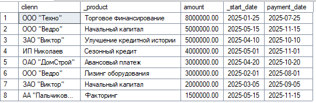
    <li><b> Процедура, на входе получающая название клиента и формирующая список с его кредитными историями в виде: название клиента, название банка, дата выдачи кредита, дата фактического погашения </li>
<pre><code>
GO
CREATE PROCEDURE CLient_Credit_History
	@client as NVARCHAR(200)
AS
BEGIN
	SELECT 
		c.company as company,
		ch.bank as bank,
		ch.deal_start_date,
		CASE WHEN ch.is_penal = 1 THEN 'Не погашено' ELSE CONVERT(NVARCHAR(10), ch.repayment_date) END as repayment_date
	FROM
		Client c 
		INNER JOIN [Credit history] ch ON ch.client_id = c.id
	WHERE
        c.company = @client;
END;
GO
EXECUTE CLient_Credit_History 'ООО "Ведро"';
</code></pre>
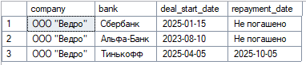
    <li><b> Процедура, на входе получающая процентную ставку, выходной параметр – название кредита с процентной ставкой, ближайшей к заданной</li>
<pre><code>
 GO
CREATE PROCEDURE Сlosest_Product
    @rate AS DECIMAL(4,2)
AS 
BEGIN
    SELECT TOP 1 WITH TIES
        title,
        rate
    FROM
        [Credit product]
    ORDER BY
        ABS(@rate - rate) ASC;
END;
GO

EXECUTE Сlosest_Product 11;
</code></pre>
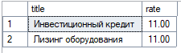
    <li><b> Процедура, вызывающая вложенную процедуру, которая подсчитывает среднюю посещаемость клиентами нашей гостиницы (т.е., сколько раз в среднем каждый клиент пользовался нашими услугами). Главная процедура выводит список клиентов, число посещений которых больше среднего.</li>
<pre><code>
 GO
CREATE PROCEDURE Most_Popular_Product
    @most_popular_product_id INT OUTPUT,
    @most_popular_product_name NVARCHAR(100) OUTPUT
AS
BEGIN
    SELECT TOP 1
        @most_popular_product_id = cp.id,
        @most_popular_product_name = cp.title
    FROM 
        [Credit product] cp
        JOIN Deal d ON cp.id = d.product_id
    GROUP BY 
        cp.id, cp.title
    ORDER BY 
        COUNT(d.id) DESC;
END;
GO
CREATE PROCEDURE Clients_With_Popular_Product
AS
BEGIN
    DECLARE @product_id INT;
    DECLARE @product_name NVARCHAR(100);
    
    EXEC Most_Popular_Product 
        @most_popular_product_id = @product_id OUTPUT,
        @most_popular_product_name = @product_name OUTPUT;
    PRINT 'Most popular: ' + @product_name;
    SELECT 
        c.company AS company,
        c.contact_person AS contact_person,
        c.phone_number AS phone_number ,
        d.deal_start AS deal_start ,
        FORMAT(d.amount, 'N2') AS amount,
        d.period_ AS 'Срок (мес.)'
    FROM 
        Client c
        JOIN Deal d ON c.id = d.client_id
    WHERE 
        d.product_id = @product_id
    ORDER BY 
        c.company;
END;

GO

EXECUTE Clients_With_Popular_Product;

</code></pre>
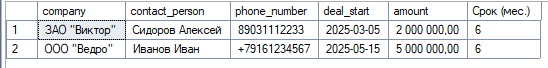
  </ol>

  <h4>Создать  3 функции:</h4>
  <ol type="a">
    <li><b>Скалярная функция,которая для заданного кредита подсчитывает выручку банка в текущем году</li>
<pre><code>
GO
CREATE FUNCTION CalculateYearRevenueByProduct(@product_id INT)
RETURNS DECIMAL(20,2)
AS
BEGIN
    DECLARE @year_revenue DECIMAL(20,2);
    SELECT @year_revenue = ISNULL(SUM(
        p.in_main_debt * (d.rate/100) +  
        ISNULL(pen.amount, 0) +    
        p.in_early_repayment * 0.01    
    ), 0)
    FROM Deal d
    LEFT JOIN Payment p ON d.id = p.deal_id 
        AND p.actual_payment_date IS NOT NULL
        AND YEAR(p.actual_payment_date) = YEAR(GETDATE())
    LEFT JOIN Penalty pen ON p.penalty_id = pen.id 
        AND pen.is_paid = 1
        AND YEAR(pen.accrual_date) = YEAR(GETDATE())
    WHERE d.product_id = @product_id;  
	RETURN @year_revenue;
END;
GO
SELECT dbo.CalculateYearRevenueByProduct(1) AS revenue;

</code></pre>
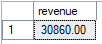
    <li><b>Inline-функция, возвращающая список кредитов, которые не были ни разу выбраны клиентами с начала текущего года </li>
<pre><code>
GO
CREATE FUNCTION GetUnusedProducts()
RETURNS TABLE
AS 
RETURN
    SELECT
        *
    FROM
        [Credit product]
    WHERE
        [Credit product].id NOT IN (
            SELECT DISTINCT d.product_id     
            FROM Deal d
            WHERE  d.deal_start >= DATEFROMPARTS(YEAR(GETDATE()),1,1)
        )
GO
SELECT * FROM dbo.GetUnusedProducts();

</code></pre>
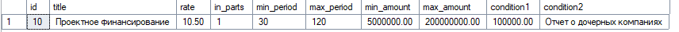
    <li><b> Multi-statement-функция, выдающая список клиентов, бравших кредиты в нашем банке более 1 раза и при этом всегда выплачивавших их вовремя
</li>
<pre><code>
GO
CREATE FUNCTION GetReliableClients()
RETURNS @ReliableClients TABLE (
    client_id INT,
    company_name NVARCHAR(200),
    contact_person NVARCHAR(100),
    loans_count INT,
    total_amount DECIMAL(20,2)
)
AS
BEGIN
    INSERT INTO @ReliableClients
    SELECT 
        c.id,
        c.company,
        c.contact_person,
        COUNT(DISTINCT d.id) AS loans_count,
        SUM(d.amount) AS total_amount
    FROM 
        Client c
        JOIN Deal d ON c.id = d.client_id
    WHERE 
        c.id IN (
            SELECT client_id 
            FROM Deal 
            GROUP BY client_id 
            HAVING COUNT(*) > 1
        )
        AND NOT EXISTS (
            SELECT 1 
            FROM Payment p 
            JOIN Deal d2 ON p.deal_id = d2.id 
            WHERE d2.client_id = c.id 
                AND p.actual_payment_date IS NULL 
                AND p.accrual_date < DATEADD(MONTH, -1, GETDATE())
        )
    GROUP BY 
        c.id, c.company, c.contact_person;
    RETURN;
END;
GO
SELECT * FROM dbo.GetReliableClients();

</code></pre>
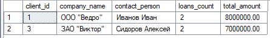
   </ol>

  <h4>Создать  3 триггера:</h4>
  <ol type="a">
    <li><b>Триггер любого типа на добавление (заключение) договора по кредиту – если этот клиент брал кредиты ранее и при этом не всегда выплачивал их вовремя, 
то договор не заключается. Если клиент брал кредиты 2 и более раз и всегда выплачивал в срок, то заключается договор с льготной процентной ставкой</li>
<pre><code>
GO
CREATE TRIGGER ReliabilityTrigger
ON Deal
INSTEAD OF INSERT
AS
BEGIN
    SET NOCOUNT ON;
    DECLARE @client_id INT;
    DECLARE @product_id INT;
    DECLARE @deal_start DATE;
    DECLARE @amount DECIMAL(20,2);
    DECLARE @period_ INT;
    DECLARE @rate DECIMAL(4,2);    
    SELECT * INTO #ReliableClients FROM dbo.GetReliableClients();    
    DECLARE deal_cursor CURSOR FOR
    SELECT 
        client_id, product_id, deal_start, amount, period_, rate
    FROM inserted;    
    OPEN deal_cursor;
    FETCH NEXT FROM deal_cursor INTO 
        @client_id, @product_id, @deal_start, @amount, @period_, @rate;    
    WHILE @@FETCH_STATUS = 0
    BEGIN
        IF EXISTS (SELECT 1 FROM #ReliableClients WHERE client_id = @client_id)
        BEGIN
            INSERT INTO Deal (client_id, product_id, deal_start, amount, period_, rate)
            VALUES (@client_id, @product_id, @deal_start, @amount, @period_, @rate);            
            PRINT 'ОДОБРЕНО: Клиент ID ' + CAST(@client_id AS VARCHAR) + 
                  ' является надежным заемщиком. Договор заключен.';
        END
        ELSE
        BEGIN
            IF EXISTS (SELECT 1 FROM Deal WHERE client_id = @client_id)
            BEGIN
                PRINT 'ОТКЛОНЕНО: Клиент ID ' + CAST(@client_id AS VARCHAR) + 
                      ' имеет историю просрочек платежей. Договор не может быть заключен.';
            END
            ELSE
            BEGIN
                INSERT INTO Deal (client_id, product_id, deal_start, amount, period_, rate)
                VALUES (@client_id, @product_id, @deal_start, @amount, @period_, @rate);                
                PRINT 'ОДОБРЕНО: Новый клиент ID ' + CAST(@client_id AS VARCHAR) + 
                      '. Договор заключен.';
            END
        END        
        FETCH NEXT FROM deal_cursor INTO 
            @client_id, @product_id, @deal_start, @amount, @period_, @rate;
    END
    CLOSE deal_cursor;
    DEALLOCATE deal_cursor;    
    DROP TABLE #ReliableClients;    
END;
GO 
SELECT TOP 4 * FROM Deal ORDER BY id DESC; 
INSERT INTO Deal (client_id, product_id, deal_start, amount, period_, rate)
VALUES 
(11, 1, '2025-11-05', 800000.00, 24, 12.5),
(3, 3, '2025-11-05', 900000.00, 18, 13.0); 
SELECT TOP 4 * FROM Deal ORDER BY id DESC

</code></pre>
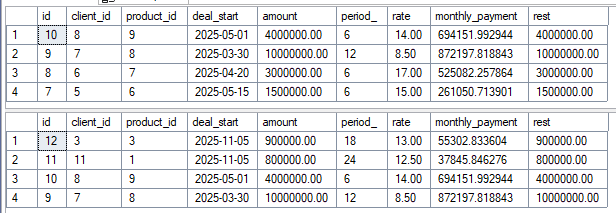
    <li><b>Последующий триггер на изменение процентной ставки по кредиту – 
если на данный кредит заключены договора, и срок оплаты еще не наступил, процентную ставку не меняем, 
в противном случае ставку можно изменить не более чем в 1.1 раза </li>
<pre><code>
GO
CREATE TRIGGER ControlRateChange
ON Deal
AFTER UPDATE
AS
BEGIN
    SET NOCOUNT ON;
    
    IF UPDATE(rate)
    BEGIN
        DECLARE @id INT, @old_rate DECIMAL(4,2), @new_rate DECIMAL(4,2), 
                @deal_start DATE, @period INT, @rest DECIMAL(20,2);
        
        DECLARE c CURSOR FOR
            SELECT i.id, d.rate, i.rate, d.deal_start, d.period_, d.rest
            FROM inserted i 
            JOIN deleted d ON i.id = d.id 
            WHERE d.rate <> i.rate;
        
        OPEN c;
        FETCH NEXT FROM c INTO @id, @old_rate, @new_rate, @deal_start, @period, @rest;
        
        WHILE @@FETCH_STATUS = 0
        BEGIN
            IF (DATEADD(MONTH, @period, @deal_start) > GETDATE() AND @rest > 0) OR
               (@new_rate > @old_rate * 1.1)
            BEGIN
                UPDATE Deal SET rate = @old_rate WHERE id = @id;
                PRINT 'Откат ставки: кредит ' + CAST(@id AS VARCHAR) + 
                      ' (' + CAST(@old_rate AS VARCHAR) + '% → ' + CAST(@new_rate AS VARCHAR) + '%)';
            END
            ELSE
            BEGIN
                PRINT 'Ставка изменена: кредит ' + CAST(@id AS VARCHAR) + 
                      ' (' + CAST(@old_rate AS VARCHAR) + '% → ' + CAST(@new_rate AS VARCHAR) + '%)';
            END
            
            FETCH NEXT FROM c INTO @id, @old_rate, @new_rate, @deal_start, @period, @rest;
        END
        
        CLOSE c;
        DEALLOCATE c;
    END
END;
GO
SELECT TOP 6 * FROM Deal; 
UPDATE Deal 
SET rate = 
    CASE 
        WHEN id = 1 THEN 18.0
        WHEN id = 2 THEN rate * 1.08
        WHEN id = 3 THEN rate * 1.15
        WHEN id = 4 THEN rate * 0.9
        WHEN id = 5 THEN rate * 1.1
    END
WHERE id IN (1, 2, 3, 4, 5);
SELECT TOP 6 * FROM Deal; 
</code></pre>
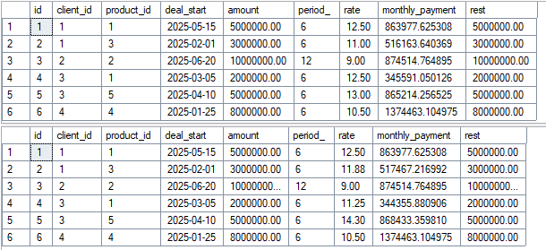
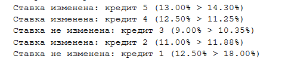
    <li><b> Замещающий триггер на операцию удаления клиента – если у него есть непогашенные кредиты, клиента не удаляем, в противном случае - удаляем </li>
<pre><code>
GO
CREATE TRIGGER InsteadClientDelete
ON Client
INSTEAD OF DELETE
AS
BEGIN
    SET NOCOUNT ON;    
    DECLARE @client_id INT, @company NVARCHAR(200);
    DECLARE c CURSOR FOR
        SELECT d.id, d.company FROM deleted d;    
    OPEN c;
    FETCH NEXT FROM c INTO @client_id, @company;    
    WHILE @@FETCH_STATUS = 0
    BEGIN
        IF EXISTS (SELECT 1 FROM Deal WHERE client_id = @client_id AND rest > 0)
        BEGIN
            PRINT 'Удаление запрещено: клиент "' + @company + '" имеет непогашенные кредиты';
        END
        ELSE
        BEGIN
            DELETE FROM Payment WHERE deal_id IN (SELECT id FROM Deal WHERE client_id = @client_id);
            DELETE FROM Deal WHERE client_id = @client_id;
            DELETE FROM Client_product WHERE client_id = @client_id;
            DELETE FROM [Credit history] WHERE client_id = @client_id;
            DELETE FROM Client WHERE id = @client_id;            
            PRINT 'Клиент "' + @company + '" удален';
        END        
        FETCH NEXT FROM c INTO @client_id, @company;
    END    
    CLOSE c;
    DEALLOCATE c;
END;
GO
SELECT * FROM Client
DELETE FROM Client WHERE company LIKE ('ООО %');
SELECT * FROM Client
</code></pre>
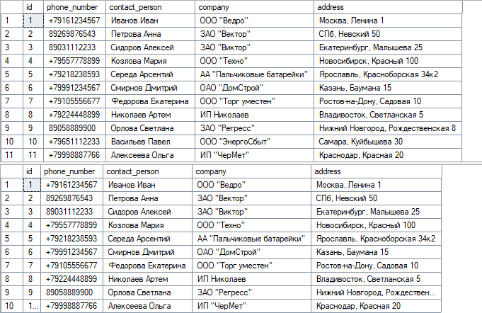

	</ol>

