<h1 name="content" align="center"> MSSQL</h1>

  
   
   
   
  
  

<h3 align="center">
  
  Вариант 22. Выдача кредитов в коммерческом банке.
  
Информация о клиентах банка: название фирмы, телефон, юр.адрес, контактное лицо, кредитная история этого клиента в других банках (в упрощенном виде: название «чужого» банка, номер кредита, сумма, дата выплаты, признак погашения).
Информация о кредитах «нашего» банка: название, процентная ставка, максимальный срок,  максимальная сумма, возможность погашения по частям.
Информация о сделках в «нашем» банке: сумма, дата выдачи, срок погашения.

Реализовать:
- Подбор кредита в соответствии с желанием клиента, заключение договора на кредитование;
- Начисление штрафа за задержку выплаты;
- Получение клиентом информации об остатке долга;
- Поиск «ненадежных» клиентов (с плохой кредитной историей – есть хотя бы один кредит в «чужом» банке, не погашенный вовремя)
- Поиск наиболее выгодных кредитов, наиболее популярных кредитов, кредитов, не пользующихся спросом

</h3>

#  Lab1
[Назад](#content)
<h3 align="center">
  
  Разработать ER-модель данной предметной области: выделить сущности, их атрибуты, связи между сущностями. 
Для каждой сущности указать ее имя, атрибут (или набор атрибутов), являющийся первичным ключом, список остальных атрибутов.
Для каждого атрибута указать его тип, ограничения, может ли он быть пустым, является ли он первичным ключом.
Для каждой связи между сущностями указать: 
- тип связи (1:1, 1:M, M:N)
- обязательность

ER-модель д.б. представлена в виде ER-диаграммы (картинка)

По имеющейся ER-модели создать реляционную модель данных и отобразить ее в виде списка сущностей с их атрибутами и типами атрибутов,  для атрибутов указать, явл. ли он первичным или внешним ключом 
</h3>

#### №1.1 ER-модель

#### №1.2 Реляционная модель

#  Lab2
[Назад](#content)
<h3 align="center">
  
  В соответствии с реляционной моделью данных, разработанной в Лаб.№1, создать реляционную БД на учебном сервере БД :
- создать таблицы, определить первичные ключи и иные ограничения
- определить связи между таблицами
- создать диаграмму
- заполнить все таблицы адекватной информацией (не меньше 10 записей в таблицах, наличие примеров для связей типа 1:M )

####

#### Диаграмма

#### Заполнение таблиц

#  Lab3
[Назад](#content)
<h3 align="center">
  
Цель: изучить конструкции языка SQL для манипулирования данными в СУБД  MSSQL.
  
Краткое описание работы:
 1. Выборка из одной таблицы.
 2. Выборка из нескольких таблиц.
 3. Представления
 4. Функции ранжирования
 5. Объдинение, пересечение, разность
 6. Использование CASE, PIVOT и UNPIVOT.
 7. Составление коткретных запросов по ТЗ
  
####

#  Lab4
[Назад](#content)
<h3 align="center">
  
</h3>

  <h4>Создать  4 различных хранимых процедуры:</h4>
  <ol type="a">
    <li><b>Процедура без параметров, формирующая список клиентов банка, не погасивших кредиты в срок в виде: клиент, название кредита, сумма, дата выдачи, дата погашения </li>
<pre><code>
GO
CREATE PROCEDURE Unscrupulous_Clients
AS
BEGIN
	SELECT
		c.company AS clienn,
		cp.title AS _product,
		d.amount AS amount,
		d.deal_start AS _start_date,
		DATEADD(MONTH, d.period_, d.deal_start) AS payment_date
	FROM 
		Deal d
		JOIN Client c ON d.client_id = c.id
		JOIN [Credit product] cp ON d.product_id = cp.id 
	WHERE
		d.rest > 0 
		AND DATEADD(MONTH, d.period_, d.deal_start) < GETDATE()
	ORDER BY
		amount DESC;

END;
GO
EXECUTE Unscrupulous_Clients;
</code></pre>

    <li><b> Процедура, на входе получающая название клиента и формирующая список с его кредитными историями в виде: название клиента, название банка, дата выдачи кредита, дата фактического погашения </li>
<pre><code>
GO
CREATE PROCEDURE CLient_Credit_History
	@client as NVARCHAR(200)
AS
BEGIN
	SELECT 
		c.company as company,
		ch.bank as bank,
		ch.deal_start_date,
		CASE WHEN ch.is_penal = 1 THEN 'Не погашено' ELSE CONVERT(NVARCHAR(10), ch.repayment_date) END as repayment_date
	FROM
		Client c 
		INNER JOIN [Credit history] ch ON ch.client_id = c.id
	WHERE
        c.company = @client;
END;
GO
EXECUTE CLient_Credit_History 'ООО "Ведро"';
</code></pre>

    <li><b> Процедура, на входе получающая процентную ставку, выходной параметр – название кредита с процентной ставкой, ближайшей к заданной</li>
<pre><code>
 GO
CREATE PROCEDURE Сlosest_Product
    @rate AS DECIMAL(4,2)
AS 
BEGIN
    SELECT TOP 1 WITH TIES
        title,
        rate
    FROM
        [Credit product]
    ORDER BY
        ABS(@rate - rate) ASC;
END;
GO

EXECUTE Сlosest_Product 11;
</code></pre>

    <li><b> Процедура, вызывающая вложенную процедуру, которая подсчитывает среднюю посещаемость клиентами нашей гостиницы (т.е., сколько раз в среднем каждый клиент пользовался нашими услугами). Главная процедура выводит список клиентов, число посещений которых больше среднего.</li>
<pre><code>
 GO
CREATE PROCEDURE Most_Popular_Product
    @most_popular_product_id INT OUTPUT,
    @most_popular_product_name NVARCHAR(100) OUTPUT
AS
BEGIN
    SELECT TOP 1
        @most_popular_product_id = cp.id,
        @most_popular_product_name = cp.title
    FROM 
        [Credit product] cp
        JOIN Deal d ON cp.id = d.product_id
    GROUP BY 
        cp.id, cp.title
    ORDER BY 
        COUNT(d.id) DESC;
END;
GO
CREATE PROCEDURE Clients_With_Popular_Product
AS
BEGIN
    DECLARE @product_id INT;
    DECLARE @product_name NVARCHAR(100);
    
    EXEC Most_Popular_Product 
        @most_popular_product_id = @product_id OUTPUT,
        @most_popular_product_name = @product_name OUTPUT;
    PRINT 'Most popular: ' + @product_name;
    SELECT 
        c.company AS company,
        c.contact_person AS contact_person,
        c.phone_number AS phone_number ,
        d.deal_start AS deal_start ,
        FORMAT(d.amount, 'N2') AS amount,
        d.period_ AS 'Срок (мес.)'
    FROM 
        Client c
        JOIN Deal d ON c.id = d.client_id
    WHERE 
        d.product_id = @product_id
    ORDER BY 
        c.company;
END;

GO

EXECUTE Clients_With_Popular_Product;

</code></pre>

  </ol>

  <h4>Создать  3 функции:</h4>
  <ol type="a">
    <li><b>Скалярная функция,которая для заданного кредита подсчитывает выручку банка в текущем году</li>
<pre><code>
GO
CREATE FUNCTION CalculateYearRevenueByProduct(@product_id INT)
RETURNS DECIMAL(20,2)
AS
BEGIN
    DECLARE @year_revenue DECIMAL(20,2);
    SELECT @year_revenue = ISNULL(SUM(
        p.in_main_debt * (d.rate/100) +  
        ISNULL(pen.amount, 0) +    
        p.in_early_repayment * 0.01    
    ), 0)
    FROM Deal d
    LEFT JOIN Payment p ON d.id = p.deal_id 
        AND p.actual_payment_date IS NOT NULL
        AND YEAR(p.actual_payment_date) = YEAR(GETDATE())
    LEFT JOIN Penalty pen ON p.penalty_id = pen.id 
        AND pen.is_paid = 1
        AND YEAR(pen.accrual_date) = YEAR(GETDATE())
    WHERE d.product_id = @product_id;  
	RETURN @year_revenue;
END;
GO
SELECT dbo.CalculateYearRevenueByProduct(1) AS revenue;

</code></pre>

    <li><b>Inline-функция, возвращающая список кредитов, которые не были ни разу выбраны клиентами с начала текущего года </li>
<pre><code>
GO
CREATE FUNCTION GetUnusedProducts()
RETURNS TABLE
AS 
RETURN
    SELECT
        *
    FROM
        [Credit product]
    WHERE
        [Credit product].id NOT IN (
            SELECT DISTINCT d.product_id     
            FROM Deal d
            WHERE  d.deal_start >= DATEFROMPARTS(YEAR(GETDATE()),1,1)
        )
GO
SELECT * FROM dbo.GetUnusedProducts();

</code></pre>

    <li><b> Multi-statement-функция, выдающая список клиентов, бравших кредиты в нашем банке более 1 раза и при этом всегда выплачивавших их вовремя
</li>
<pre><code>
GO
CREATE FUNCTION GetReliableClients()
RETURNS @ReliableClients TABLE (
    client_id INT,
    company_name NVARCHAR(200),
    contact_person NVARCHAR(100),
    loans_count INT,
    total_amount DECIMAL(20,2)
)
AS
BEGIN
    INSERT INTO @ReliableClients
    SELECT 
        c.id,
        c.company,
        c.contact_person,
        COUNT(DISTINCT d.id) AS loans_count,
        SUM(d.amount) AS total_amount
    FROM 
        Client c
        JOIN Deal d ON c.id = d.client_id
    WHERE 
        c.id IN (
            SELECT client_id 
            FROM Deal 
            GROUP BY client_id 
            HAVING COUNT(*) > 1
        )
        AND NOT EXISTS (
            SELECT 1 
            FROM Payment p 
            JOIN Deal d2 ON p.deal_id = d2.id 
            WHERE d2.client_id = c.id 
                AND p.actual_payment_date IS NULL 
                AND p.accrual_date < DATEADD(MONTH, -1, GETDATE())
        )
    GROUP BY 
        c.id, c.company, c.contact_person;
    RETURN;
END;
GO
SELECT * FROM dbo.GetReliableClients();

</code></pre>

   </ol>

  <h4>Создать  3 триггера:</h4>
  <ol type="a">
    <li><b>Триггер любого типа на добавление (заключение) договора по кредиту – если этот клиент брал кредиты ранее и при этом не всегда выплачивал их вовремя, 
то договор не заключается. Если клиент брал кредиты 2 и более раз и всегда выплачивал в срок, то заключается договор с льготной процентной ставкой</li>
<pre><code>
GO
CREATE TRIGGER ReliabilityTrigger
ON Deal
INSTEAD OF INSERT
AS
BEGIN
    SET NOCOUNT ON;
    DECLARE @client_id INT;
    DECLARE @product_id INT;
    DECLARE @deal_start DATE;
    DECLARE @amount DECIMAL(20,2);
    DECLARE @period_ INT;
    DECLARE @rate DECIMAL(4,2);    
    SELECT * INTO #ReliableClients FROM dbo.GetReliableClients();    
    DECLARE deal_cursor CURSOR FOR
    SELECT 
        client_id, product_id, deal_start, amount, period_, rate
    FROM inserted;    
    OPEN deal_cursor;
    FETCH NEXT FROM deal_cursor INTO 
        @client_id, @product_id, @deal_start, @amount, @period_, @rate;    
    WHILE @@FETCH_STATUS = 0
    BEGIN
        IF EXISTS (SELECT 1 FROM #ReliableClients WHERE client_id = @client_id)
        BEGIN
            INSERT INTO Deal (client_id, product_id, deal_start, amount, period_, rate)
            VALUES (@client_id, @product_id, @deal_start, @amount, @period_, @rate);            
            PRINT 'ОДОБРЕНО: Клиент ID ' + CAST(@client_id AS VARCHAR) + 
                  ' является надежным заемщиком. Договор заключен.';
        END
        ELSE
        BEGIN
            IF EXISTS (SELECT 1 FROM Deal WHERE client_id = @client_id)
            BEGIN
                PRINT 'ОТКЛОНЕНО: Клиент ID ' + CAST(@client_id AS VARCHAR) + 
                      ' имеет историю просрочек платежей. Договор не может быть заключен.';
            END
            ELSE
            BEGIN
                INSERT INTO Deal (client_id, product_id, deal_start, amount, period_, rate)
                VALUES (@client_id, @product_id, @deal_start, @amount, @period_, @rate);                
                PRINT 'ОДОБРЕНО: Новый клиент ID ' + CAST(@client_id AS VARCHAR) + 
                      '. Договор заключен.';
            END
        END        
        FETCH NEXT FROM deal_cursor INTO 
            @client_id, @product_id, @deal_start, @amount, @period_, @rate;
    END
    CLOSE deal_cursor;
    DEALLOCATE deal_cursor;    
    DROP TABLE #ReliableClients;    
END;
GO 
SELECT TOP 4 * FROM Deal ORDER BY id DESC; 
INSERT INTO Deal (client_id, product_id, deal_start, amount, period_, rate)
VALUES 
(11, 1, '2025-11-05', 800000.00, 24, 12.5),
(3, 3, '2025-11-05', 900000.00, 18, 13.0); 
SELECT TOP 4 * FROM Deal ORDER BY id DESC

</code></pre>

    <li><b>Последующий триггер на изменение процентной ставки по кредиту – 
если на данный кредит заключены договора, и срок оплаты еще не наступил, процентную ставку не меняем, 
в противном случае ставку можно изменить не более чем в 1.1 раза </li>
<pre><code>
GO
CREATE TRIGGER ControlRateChange
ON Deal
AFTER UPDATE
AS
BEGIN
    SET NOCOUNT ON;
    
    IF UPDATE(rate)
    BEGIN
        DECLARE @id INT, @old_rate DECIMAL(4,2), @new_rate DECIMAL(4,2), 
                @deal_start DATE, @period INT, @rest DECIMAL(20,2);
        
        DECLARE c CURSOR FOR
            SELECT i.id, d.rate, i.rate, d.deal_start, d.period_, d.rest
            FROM inserted i 
            JOIN deleted d ON i.id = d.id 
            WHERE d.rate <> i.rate;
        
        OPEN c;
        FETCH NEXT FROM c INTO @id, @old_rate, @new_rate, @deal_start, @period, @rest;
        
        WHILE @@FETCH_STATUS = 0
        BEGIN
            IF (DATEADD(MONTH, @period, @deal_start) > GETDATE() AND @rest > 0) OR
               (@new_rate > @old_rate * 1.1)
            BEGIN
                UPDATE Deal SET rate = @old_rate WHERE id = @id;
                PRINT 'Откат ставки: кредит ' + CAST(@id AS VARCHAR) + 
                      ' (' + CAST(@old_rate AS VARCHAR) + '% → ' + CAST(@new_rate AS VARCHAR) + '%)';
            END
            ELSE
            BEGIN
                PRINT 'Ставка изменена: кредит ' + CAST(@id AS VARCHAR) + 
                      ' (' + CAST(@old_rate AS VARCHAR) + '% → ' + CAST(@new_rate AS VARCHAR) + '%)';
            END
            
            FETCH NEXT FROM c INTO @id, @old_rate, @new_rate, @deal_start, @period, @rest;
        END
        
        CLOSE c;
        DEALLOCATE c;
    END
END;
GO
SELECT TOP 6 * FROM Deal; 
UPDATE Deal 
SET rate = 
    CASE 
        WHEN id = 1 THEN 18.0
        WHEN id = 2 THEN rate * 1.08
        WHEN id = 3 THEN rate * 1.15
        WHEN id = 4 THEN rate * 0.9
        WHEN id = 5 THEN rate * 1.1
    END
WHERE id IN (1, 2, 3, 4, 5);
SELECT TOP 6 * FROM Deal; 
</code></pre>

    <li><b> Замещающий триггер на операцию удаления клиента – если у него есть непогашенные кредиты, клиента не удаляем, в противном случае - удаляем </li>
<pre><code>
GO
CREATE TRIGGER InsteadClientDelete
ON Client
INSTEAD OF DELETE
AS
BEGIN
    SET NOCOUNT ON;    
    DECLARE @client_id INT, @company NVARCHAR(200);
    DECLARE c CURSOR FOR
        SELECT d.id, d.company FROM deleted d;    
    OPEN c;
    FETCH NEXT FROM c INTO @client_id, @company;    
    WHILE @@FETCH_STATUS = 0
    BEGIN
        IF EXISTS (SELECT 1 FROM Deal WHERE client_id = @client_id AND rest > 0)
        BEGIN
            PRINT 'Удаление запрещено: клиент "' + @company + '" имеет непогашенные кредиты';
        END
        ELSE
        BEGIN
            DELETE FROM Payment WHERE deal_id IN (SELECT id FROM Deal WHERE client_id = @client_id);
            DELETE FROM Deal WHERE client_id = @client_id;
            DELETE FROM Client_product WHERE client_id = @client_id;
            DELETE FROM [Credit history] WHERE client_id = @client_id;
            DELETE FROM Client WHERE id = @client_id;            
            PRINT 'Клиент "' + @company + '" удален';
        END        
        FETCH NEXT FROM c INTO @client_id, @company;
    END    
    CLOSE c;
    DEALLOCATE c;
END;
GO
SELECT * FROM Client
DELETE FROM Client WHERE company LIKE ('ООО %');
SELECT * FROM Client
</code></pre>

	</ol>

		
#  Lab6
[Назад](#content)
<h3 align="center">
  
	</h3>
  Создание графовых таблиц и работа с ними.

<li><b>Используйте реляционную БД из лабораторной работы №2.
Продумайте и создайте графовые таблицы по реляционной БД</li>
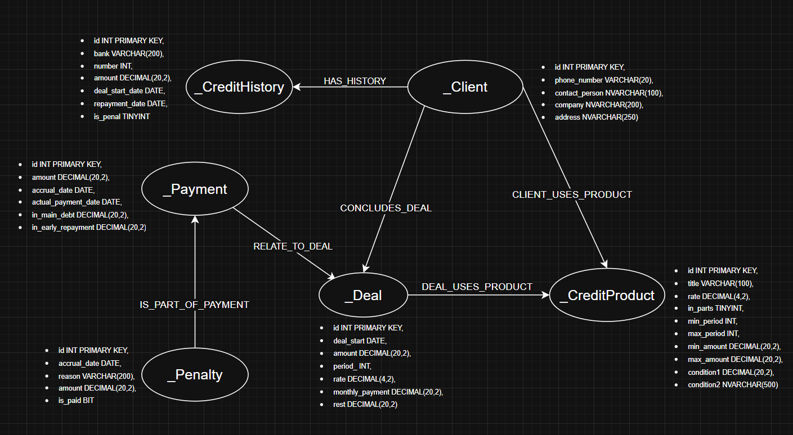
<li><b>Заполнение графовых таблиц используя данные из реляционных таблиц.</li>
<pre><code>
	DROP TABLE IF EXISTS HAS_HISTORY;
DROP TABLE IF EXISTS CLIENT_USES_PRODUCT;
DROP TABLE IF EXISTS CONCLUDES_DEAL;
DROP TABLE IF EXISTS _history_has_penalty;
DROP TABLE IF EXISTS IS_PART_OF_PAYMENT;
DROP TABLE IF EXISTS RELATE_TO_DEAL;
DROP TABLE IF EXISTS DEAL_USES_PRODUCT;
DROP TABLE IF EXISTS _client;
DROP TABLE IF EXISTS _credit_history;
DROP TABLE IF EXISTS _credit_product;
DROP TABLE IF EXISTS _deal;
DROP TABLE IF EXISTS _penalty;
DROP TABLE IF EXISTS _payment;
GO

CREATE TABLE _client (
    id INT PRIMARY KEY,
    phone_number VARCHAR(20),
    contact_person NVARCHAR(100),
    company NVARCHAR(200),
    address NVARCHAR(250)
) AS NODE;

CREATE TABLE _credit_history (
    id INT PRIMARY KEY,
    bank VARCHAR(200),
    number INT,
    amount DECIMAL(20,2),
    deal_start_date DATE,
    repayment_date DATE,
    is_penal TINYINT
) AS NODE;

CREATE TABLE _credit_product (
    id INT PRIMARY KEY,
    title VARCHAR(100),
    rate DECIMAL(4,2),
    in_parts TINYINT,
    min_period INT,
    max_period INT,
    min_amount DECIMAL(20,2),
    max_amount DECIMAL(20,2),
    condition1 DECIMAL(20,2),
    condition2 NVARCHAR(500)
) AS NODE;

CREATE TABLE _deal (
    id INT PRIMARY KEY,
    deal_start DATE,
    amount DECIMAL(20,2),
    period_ INT,
    rate DECIMAL(4,2),
    monthly_payment DECIMAL(20,2),
    rest DECIMAL(20,2)
) AS NODE;

CREATE TABLE _penalty (
    id INT PRIMARY KEY,
    accrual_date DATE,
    reason VARCHAR(200),
    amount DECIMAL(20,2),
    is_paid BIT
) AS NODE;

CREATE TABLE _payment (
    id INT PRIMARY KEY,
    amount DECIMAL(20,2),
    accrual_date DATE,
    actual_payment_date DATE,
    in_main_debt DECIMAL(20,2),
    in_early_repayment DECIMAL(20,2)
) AS NODE;
GO

CREATE TABLE HAS_HISTORY AS EDGE;
CREATE TABLE CLIENT_USES_PRODUCT AS EDGE;
CREATE TABLE CONCLUDES_DEAL AS EDGE;
CREATE TABLE IS_PART_OF_PAYMENT AS EDGE;
CREATE TABLE RELATE_TO_DEAL AS EDGE;
CREATE TABLE DEAL_USES_PRODUCT AS EDGE;
GO

INSERT INTO _client (id, phone_number, contact_person, company, address)
SELECT id, phone_number, contact_person, company, address FROM Client;

INSERT INTO _credit_history (id, bank, number, amount, deal_start_date, repayment_date, is_penal)
SELECT id, bank, number, amount, deal_start_date, repayment_date, is_penal FROM [Credit history];

INSERT INTO _credit_product (id, title, rate, in_parts, min_period, max_period, min_amount, max_amount, condition1, condition2)
SELECT id, title, rate, in_parts, min_period, max_period, min_amount, max_amount, condition1, condition2 FROM [Credit product];

INSERT INTO _deal (id, deal_start, amount, period_, rate, monthly_payment, rest)
SELECT id, deal_start, amount, period_, rate, 
       amount * (rate/100/12) * POWER(1 + (rate/100/12), period_) / (POWER(1 + (rate/100/12), period_) - 1),
       amount
FROM Deal;

INSERT INTO _penalty (id, accrual_date, reason, amount, is_paid)
SELECT id, accrual_date, reason, amount, is_paid FROM Penalty;

INSERT INTO _payment (id, amount, accrual_date, actual_payment_date, in_main_debt, in_early_repayment)
SELECT id, amount, accrual_date, actual_payment_date, in_main_debt, in_early_repayment FROM Payment;
GO

INSERT INTO HAS_HISTORY ($from_id, $to_id)
SELECT 
    c.$node_id,
    ch.$node_id
FROM _Client c
 JOIN [Credit history] rch ON c.id = rch.client_id
 JOIN _Credit_history ch ON ch.id = rch.id;
GO

INSERT INTO CLIENT_USES_PRODUCT ($from_id, $to_id)
SELECT 
    c.$node_id,
    cp.$node_id
FROM _Client c
 JOIN Client_product rcp ON c.id = rcp.client_id
 JOIN _Credit_product cp ON cp.id = rcp.product_id;
GO

INSERT INTO CONCLUDES_DEAL ($from_id, $to_id)
SELECT 
    c.$node_id,
    d.$node_id
FROM _Client c
 JOIN Deal rd ON c.id = rd.client_id
 JOIN _Deal d ON d.id = rd.id;
GO

INSERT INTO IS_PART_OF_PAYMENT ($from_id, $to_id)
SELECT 
    p.$node_id,
    pay.$node_id
FROM _Penalty p
 JOIN Payment rpay ON p.id = rpay.penalty_id
 JOIN _Payment pay ON pay.id = rpay.id;
GO

INSERT INTO RELATE_TO_DEAL ($from_id, $to_id)
SELECT 
    pay.$node_id,
    d.$node_id
FROM _Payment pay
 JOIN Payment rpay ON pay.id = rpay.id
 JOIN _Deal d ON d.id = rpay.deal_id;
GO

INSERT INTO DEAL_USES_PRODUCT ($from_id, $to_id)
SELECT DISTINCT
    d.$node_id,
    cp.$node_id
FROM _Deal d
 JOIN Deal rd ON d.id = rd.id
 JOIN _Credit_product cp ON cp.id = rd.product_id;
GO
</code></pre>
<li><b>Напишите запросы из задания 3.2 используя паттерн MATCH.
Сравните полученные результаты  с  результатами запросов к реляционной модели.
</li>
	
1. Краткий вывод кредитной истории клиентов с именами кредиторов
<pre><code>
SELECT 
    c.contact_person, ch.bank, ch.amount 
FROM 
    _Client c, _Credit_history ch, HAS_HISTORY chh
WHERE 
    MATCH(c-(chh)->ch);
</code></pre>

2. Вывод существующих сделок с указанием названия выбранного кредитного продукта
<pre><code>
SELECT 
    d.amount, cp.title 
FROM 
    _Deal d, _Credit_product cp, DEAL_USES_PRODUCT dup
WHERE 
    MATCH(d-(dup)->cp);

</code></pre>
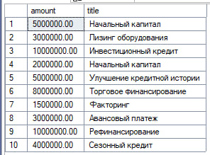

3. Вывод размера сделок с поступившими на них платежами
<pre><code>
SELECT 
    d.id as deal_id, d.rest, p.amount, p.accrual_date 
FROM 
    _Payment p, _deal d, RELATE_TO_DEAL pfd
WHERE 
    MATCH(p-(pfd)->d);
</code></pre>
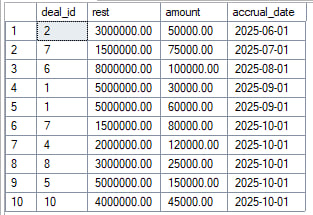

4. Все кредитные продукты и сделки по ним 
<pre><code>
SELECT 
    cp.title AS product_name, 
    cp.rate, 
    ISNULL(d.amount, 0) AS deal_amount,
    CASE 
        WHEN d.id IS NULL THEN 'Сделок нет'
        ELSE CONCAT('Заключено: ', CAST(d.amount AS VARCHAR(20)))
    END AS deal_info
FROM 
    _Credit_product cp
    LEFT JOIN (_Deal d, DEAL_USES_PRODUCT dup) 
        ON MATCH(cp<-(dup)-d)
ORDER BY 
    cp.title;
</code></pre>
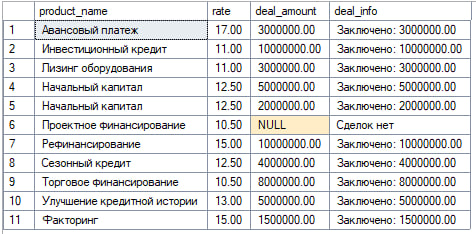

5. Клиенты с общей суммой кредитов более 1 млн
<pre><code>
SELECT 
    c.contact_person, 
    SUM(ch.amount) as total_credit
FROM 
    _Client c, _credit_history ch, HAS_HISTORY chh
WHERE 
    MATCH(c-(chh)->ch)
GROUP BY 
    c.id, c.contact_person
HAVING 
    SUM(ch.amount) > 1000000;
</code></pre>

6. Статистика использования кредитных продуктов
<pre><code>
SELECT 
    cp.title, 
    COUNT(d.id) as deal_count, 
    SUM(ISNULL(d.amount, 0)) as total_deal_amount
FROM 
    _Credit_product cp
    LEFT JOIN (_Deal d, DEAL_USES_PRODUCT dup) 
        ON MATCH(cp<-(dup)-d)
GROUP BY 
    cp.title, cp.id;
</code></pre>
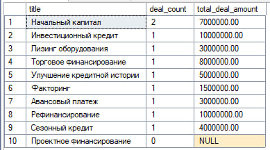

7. Клиенты, у которых есть неоплаченные штрафы 
<pre><code>
SELECT 
    c.contact_person, 
    c.company, 
    c.address
FROM 
    _client c
WHERE 
    EXISTS (
        SELECT 1 
        FROM _Credit_history ch, HAS_HISTORY chh
        WHERE MATCH(c-(chh)->ch)
          AND ch.is_penal = 1
    );
</code></pre>

#  Lab7
[Назад](#content)
<h3 align="center">
   </h3>
  <h3>Задание 1</h3>
  
Используя базу, полученную в лабораторной 2, создать транзакцию, произвести ее откат и фиксацию. Показать, что данные существовали до отката, удалились после отката, снова были добавлены, и затем были успешно зафиксированы. При необходимости используйте точки сохранения и вложенные транзакции.

<pre><code>
BEGIN TRANSACTION;

SELECT * FROM Client WHERE id > 8 ORDER BY id ASC;

INSERT INTO Client (phone_number, contact_person, company, address)
VALUES ('+79160001111', 'Смирнова Анна', 'ООО "СтройГрад"', 'Москва, Строителей 15');

SELECT * FROM Client WHERE id > 8 ORDER BY id ASC;

ROLLBACK TRANSACTION;

SELECT * FROM Client WHERE id > 8 ORDER BY id ASC;
GO

BEGIN TRANSACTION;

INSERT INTO Client (phone_number, contact_person, company, address)
VALUES ('+79262223344', 'Ковалев Георгий', 'ЗАО "ТехноПрофи"', 'Санкт-Петербург, Техническая 25');

SELECT * FROM Client WHERE id > 8 ORDER BY id ASC;

SAVE TRANSACTION Savepoint1;

INSERT INTO Client (phone_number, contact_person, company, address)
VALUES ('+79035556677', 'Петрова Анна', 'ИП Петрова', 'Екатеринбург, Торговая 30');

SELECT * FROM Client WHERE id > 8 ORDER BY id ASC;

ROLLBACK TRANSACTION Savepoint1;

SELECT * FROM Client WHERE id > 8 ORDER BY id ASC;

COMMIT TRANSACTION;

SELECT * FROM Client WHERE id > 8 ORDER BY id ASC;
GO
</code></pre>

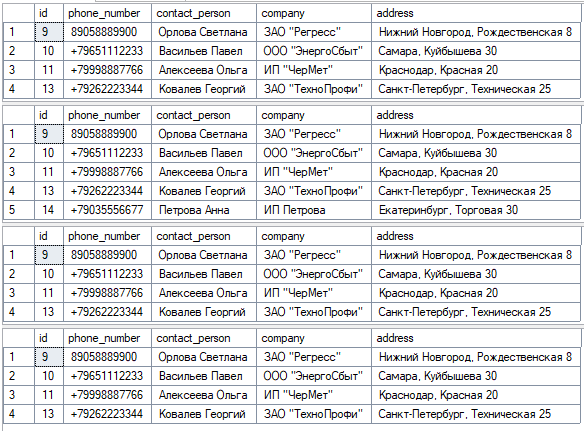
  <h3>Задание 2</h3>
  
Подготовить SQL-скрипты для выполнения проверок изолированности транзакций. Ваши скрипты должны работать с одной из таблиц, созданных в лабораторной работе №2.

  <h4>Выполнение работы</h4>
    1. Запустить клиента и соединиться с базой данных. Открыть второе окно для ввода текста запросов (Ctrl+N в первом окне).
    
	2. Установить в обоих сеансах уровень изоляции READ UNCOMMITTED. Выполнить сценарии проверки:
     - потерянных изменений,
Сеанс 1:
<pre><code>
SET TRANSACTION ISOLATION LEVEL READ UNCOMMITTED;
BEGIN TRANSACTION;

SELECT * FROM Client WHERE id = 10;

UPDATE Client SET company = 'ООО "СбытЭнерго"' 
WHERE company = 'ООО "ЭнергоСбыт"';

WAITFOR DELAY '00:00:10';

COMMIT TRANSACTION;

SELECT * FROM Client WHERE id = 10;
GO
</code></pre>

Сеанс 2:
<pre><code>
SET TRANSACTION ISOLATION LEVEL READ UNCOMMITTED;
BEGIN TRANSACTION;

SELECT * FROM Client WHERE id = 10;

UPDATE Client SET company = 'ООО "СбытЭнерго"' 
WHERE company = 'ООО "ЭнергоСбыт"';

WAITFOR DELAY '00:00:10';

COMMIT TRANSACTION;

SELECT * FROM Client WHERE id = 10;
GO
</code></pre>
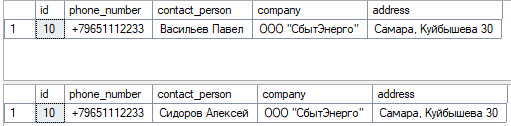

	-грязного чтения,
Сеанс 1:
<code><pre>

SET TRANSACTION ISOLATION LEVEL READ UNCOMMITTED;

WAITFOR DELAY '00:00:05';

BEGIN TRANSACTION;

SELECT * FROM Client WHERE id = 6;

WAITFOR DELAY '00:00:10';
COMMIT;

SELECT * FROM Client WHERE id = 6;
</pre></code>
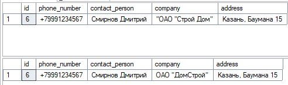

Сеанс 2:
<code><pre>
SET TRANSACTION ISOLATION LEVEL READ UNCOMMITTED;

BEGIN TRANSACTION;

SELECT * FROM Client WHERE id = 6; 

UPDATE Client SET company = '"ОАО "Строй Дом"' WHERE id = 6;

WAITFOR DELAY '00:00:10';

ROLLBACK;

SELECT * FROM Client WHERE id = 6;
</pre></code>
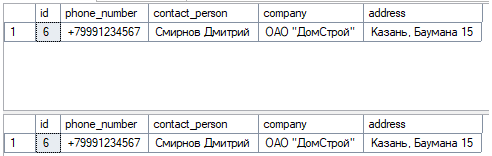

	3. Записать протокол выполнения сценариев. 
	
	4.Установить в обоих сеансах уровень изоляции READ COMMITTED. Выполнить сценарии проверки: 
грязного чтения. 

Сеанс 1:

<code><pre>

SET TRANSACTION ISOLATION LEVEL READ COMMITTED;

WAITFOR DELAY '00:00:05';

BEGIN TRANSACTION;

SELECT * FROM Client WHERE id = 7;

WAITFOR DELAY '00:00:10';

COMMIT;

SELECT * FROM Client WHERE id = 7;
</pre></code>
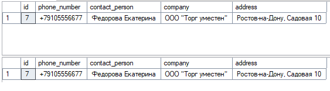

Сеанс 2:
<code><pre>
SET TRANSACTION ISOLATION LEVEL READ COMMITTED;

BEGIN TRANSACTION;

SELECT * FROM Client WHERE id = 7;

UPDATE Client 
SET company = 'ООО "Новое название"', 
    contact_person = 'Новое имя'
WHERE id = 7;

WAITFOR DELAY '00:00:10';

ROLLBACK;

SELECT * FROM Client WHERE id = 7;
</pre></code>
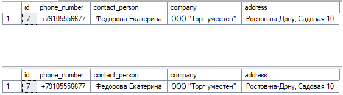

